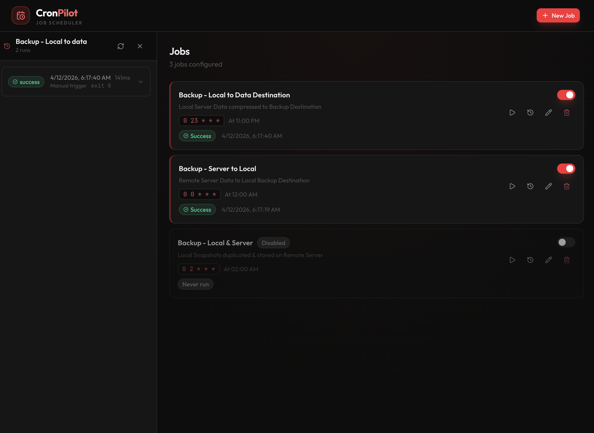
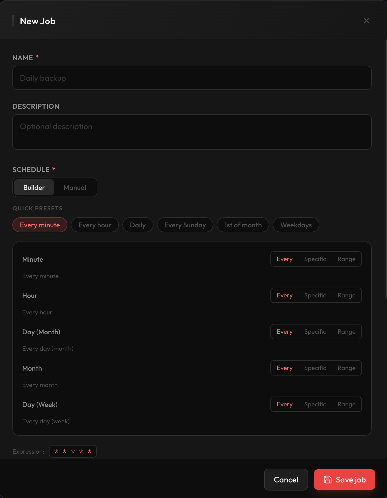

## CronPilot - Set it, Forget it, Stop fucking around in crontab

<p align="center">
  <a href="https://cronpilot.orange-coding.net/">Website</a>
</p>

<p align="center">
    
  
</p>

A self-hosted cron job manager with a modern, mobile-friendly web UI. Create and monitor scheduled tasks that run shell scripts or inline commands. Optional push notifications via ntfy.
</p>

## Screenshots

|           Job Overview            |           Job Editor            |
|:---------------------------------:|:-------------------------------:|
|  |  |

---

## Features

- Create and manage cron jobs with a visual schedule builder or raw cron expression input
- Real-time cron expression validation with a human-readable description and next run preview
- Run shell scripts or multi-line inline commands
- Enable or disable jobs with a single toggle
- Trigger any job manually on demand
- Full run history with stdout/stderr output, exit codes, and durations
- Optional push notifications via [ntfy](https://ntfy.sh): notify on error, on every run, or both
- SQLite database - no external dependencies required
- Responsive UI that works on desktop and mobile

---

## Docker

The easiest way to run CronPilot is with Docker:

```bash
docker run -d \
  --name cronpilot \
  -p 3001:3001 \
  -v $(pwd)/db:/data \
  ghcr.io/orangecoding/cronpilot:latest
```

Or with docker compose - copy `docker-compose.yml` from this repo and run:

```bash
docker compose up -d
```

The database is stored in the `/data` volume. Open [http://localhost:3001](http://localhost:3001) in your browser.

### Configuration

To configure Docker, create a `.env` file next to `docker-compose.yml`:

Copy the .env.example.

Docker Compose automatically reads this file. `HOST` and `DB_PATH` are fixed inside the container and cannot be overridden.

---

## Prerequisites

- Node.js 20 or later
- yarn

---

## Installation

```bash
git clone https://github.com/orangecoding/cronpilot
cd cronpilot

# Install all dependencies (root + server + client)
yarn install
yarn --cwd server install
yarn --cwd client install
```

---

## Configuration

Copy the example env file and edit it:

```bash
cp .env.example .env
```

Available options:

| Variable | Default | Description |
|---|---|---|
| `PORT` | `3001` | Port for the HTTP server |
| `HOST` | `localhost` | Host to bind the server to |
| `DB_PATH` | `./cronpilot.db` | Path to the SQLite database file |
| `EXEC_TIMEOUT_MS` | `1800000` | Max execution time per job in milliseconds (30 min) |
| `KEEP_MAX_FOR_HISTORY` | `5` | Maximum run history entries kept per job; older runs are deleted automatically |
| `LOG_LEVEL` | `info` | Log verbosity: `error`, `warn`, `info`, `debug` |
| `GATEWAY_TOKEN` | _(unset)_ | Optional shared secret to protect the UI and API (see [Security](#security)) |

---

## Security

CronPilot supports a simple gateway token to restrict access to the UI and API. When `GATEWAY_TOKEN` is set, every API request must include the token, any request without it is rejected with `401 Unauthorized`.

### Setting up the token

Generate a secure random token and add it to your `.env`:

```bash
# Using openssl (recommended)
openssl rand -hex 32

# Or using Node.js
node -e "console.log(require('crypto').randomBytes(32).toString('hex'))"
```

Add the result to `.env`:

```
GATEWAY_TOKEN=a3f8c2d1e9b4...
```

### Accessing the UI

Append `?token=YOUR_TOKEN` to the URL when opening CronPilot in your browser:

```
http://localhost:3001?token=YOUR_TOKEN
```

If the token is missing or incorrect, you will see an access denied page. If `GATEWAY_TOKEN` is not set, no authentication is required and the app is accessible to anyone who can reach the server.

### Docker

Pass the token as an environment variable:

```bash
docker run -d \
  --name cronpilot \
  -p 3001:3001 \
  -v $(pwd)/db:/data \
  -e GATEWAY_TOKEN=your_token_here \
  ghcr.io/orangecoding/cronpilot:latest
```

---

## Running in Development

Start both the server and the Vite dev server:

```bash
yarn dev
```

Or start them individually:

```bash
yarn dev:server   # Node.js server on port 3001
yarn dev:client   # Vite dev server (proxies /api to port 3001)
```

Open [http://localhost:5173](http://localhost:5173) in your browser.

---

## Running Tests

```bash
# All tests
yarn test

# Server tests only
yarn test:server

# Client tests only
yarn test:client
```

---

## Linting

```bash
yarn lint        # Check for issues
yarn lint:fix    # Auto-fix where possible
yarn format      # Format all files with Prettier
```

A pre-commit hook (via husky + lint-staged) automatically lints and formats staged files before each commit.

---

## Building for Production

```bash
yarn build    # Builds the React app into client/dist/
yarn start    # Starts the server, which serves the built client
```

Open [http://localhost:3001](http://localhost:3001) in your browser.

---

## ntfy Integration

CronPilot can send push notifications via [ntfy](https://ntfy.sh) (self-hosted or the public instance).

When creating or editing a job, expand the "Notifications" section and:

1. Enable notifications
2. Set the ntfy server URL (default: `https://ntfy.sh`)
3. Set a topic name
4. Choose when to notify: on error, on every run, or both

Notifications are sent as HTTP POST requests. If the ntfy server is unreachable, the job continues to run normally and the error is silently ignored.

---

## Related Projects

Other open-source tools by the same author:

- [fredy](https://github.com/orangecoding/fredy) - Automated real estate search: monitors listing portals and sends notifications when new properties matching your criteria appear
- [pm2-hawkeye](https://github.com/orangecoding/pm2-hawkeye) - A beautiful web UI for monitoring and managing PM2 processes

---

## License

Apache-2.0
